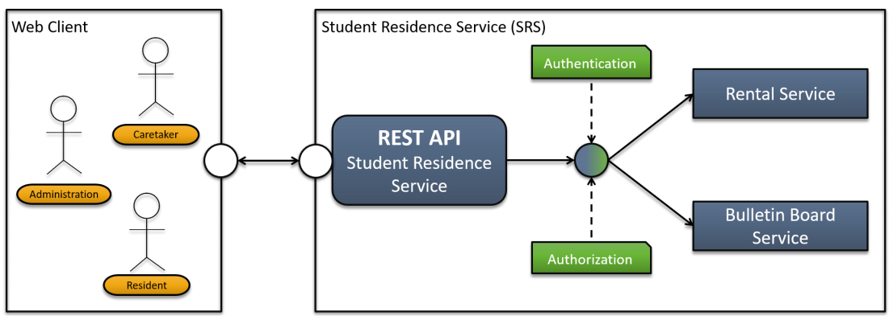

# Student Residence Service

## About project
This project is about creating a REST API for the student residence service. 



## There are two main services
<ul>
    <li><i><b>Rental Service</b></i>: rent home appliances (vacuum, clothes iron, waffle
iron) and common space (e.g. for playing games or having a party)</li>
    <li><i><b>Bulletin Board Service</b></i>: be update to date with news announced by the
    administration and comment news</li>
</ul>

## Who are Web Clients?
### Resident
Resident can be any student who wants to use the service to make his/her life easier in case of renting house appliances which are provided by administration.
Also the student can be up to date with news from administration through this REST API.

### Administration
Administrator manages the rented house appliances. Also, Administrator can announce news to all students through this REST API.

### Caretaker
<p>Caretaker can get notification through this REST API to know about the broken appliances in the residence. The notification can be from students or administrator.</p>


## Use Cases
### Use Case 1
<p>Administrator can add home appliances with following criteria:</p> 
    <ul>
        <li>Home appliance information contains the serial number, model name, and type</li>
        <li>Types of home appliances are: Vacuum, Clothes Iron, Waffle Iron, Party Room, Table Room</li>
        <li>The API could show the number of available home appliances and the current state (broken/not broken)
        <li>The API should show the price for rental (€/day) and the maximum amount of time a home appliance can be rented</li>
    </ul>        
<p>The API should store the Home appliances in permanent database</p>
<p>The API should have proper response code such as <i>200</i> for successful creation of resource or <i>400</i> for the failed request</p>
<p>Each response should contain Hal-Links which indicate what can be done with resource for example GET</p>

### Use Case 2
<p>Resident or caretaker should be able to know which home appliances can be rented with such acceptance criteria:</p> 
    <ul>
        <li>A set of home appliances can be found by model name</li>
        <li>
            A set of home appliances can be found by type
        </li> 
        <li>
            A set of home appliances can be found by status
        </li>
        <li>
            The response should contain all the information (price, days of rent, ..) of a rent beside its internal id
        </li>
        <li>
            The API should have proper response code accordingly such as <i>200</i> or </i>400</li>
        </li>
        <li>
            Each response should contain the Hal-Links which show what can be done with Resource such sa GET or POST
        </li>    
    </ul>
    

### Use Case 3
<p>Resident can rent a home appliance with such criteria:</p> 
    <ul>
        <li>A rent contain with following information such as student's name, room number, start and end of rent, rent's creation date, calculated price for the number of days a home appliance can be rented</li>
        <li>
            The maximum time of rent defined by a home appliance must not be exceeded
        </li> 
        <li>
            Only a home appliances which are not broken or available can be rented
        </li>
        <li>
            The rent information should be saved in a database to be persistence
        </li>
        <li>
            The server should have proper response code accordingly    
        </li>
        <li>
            Each response should contain the Hal-Links which show what can be done with Resource such sa GET or POST
        </li>    
    </ul>
    
### Use Case 4
<p>Resident can terminate the rent with such criteria:</p> 
    <ul>
        <li>
            If the rent existed in database
        </li>
        <li>
            A termination can be done any time (before and during rent)    
        </li> 
        <li>
            After the termination, the rented home appliance can be rented again    
        </li>
        <li>
            The server should have proper response code accordingly    
        </li>
        <li>
            Each response should contain the Hal-Links which show what can be done with Resource such sa GET or POST
        </li>    
    </ul>
    
### Use Case 5
<p>Resident or Administrator can retrive a specific rent by its id with such criteria:</p> 
    <ul>
        <li>
            A rent can be found by student's name
        </li>
        <li>
            A resident can retrieve his/her own rent    
        </li> 
        <li>
            Administrator can retrieve all rented home appliances   
        </li>
        <li>
            Each response contain all the information of a rent beside its own internal id
        </li>
        <li>
            The server should have proper response code accordingly    
        </li>
        <li>
            Each response should contain the Hal-Links which show what can be done with Resource such sa GET or POST
        </li>    
    </ul>
    
### Use Case 6
<p>Administrator can add an announcement to the Bulletin Board with such criteria:</p> 
    <ul>
        <li>
            Announcement contains the following information such as: issuer's name, issue type (general information, maintenance notice, new home appliance available), issue description as a message with length of 500 characters, the priority level (low, normal, high)
        </li>
        <li>
            The announcement should be stored in database to be retrieved in later point of time 
        </li> 
        <li>
            If the announcement is type of <b>New HA available</b> the HA should be linked  
        </li>
        <li>
            Each response contain all the information of a rent beside its own internal id
        </li>
        <li>
            The server should have proper response code accordingly    
        </li>
        <li>
            Each response should contain the Hal-Links which show what can be done with Resource such sa GET or POST
        </li>    
    </ul>
    
### Use Case 7
<p>Resident can reply to an announcement with such criteria:</p> 
    <ul>
        <li>
            The replay must contain the name of person who replies, date and time of reply's creation, textual message of the replay (at most 200 characters), ID of the news it refers to
        </li>
        <li>
            The reply should be stored in the database for future retrieves    
        </li>
        <li>
            The server should have proper response code accordingly    
        </li>
        <li>
            Each response should contain the Hal-Links which show what can be done with Resource such sa GET or POST
        </li>    
    </ul>
    
### Use Case 8
<p>Resident/ Administrator/ Caretaker can retrieve a specific announcement with such criteria:</p> 
    <ul>
        <li>
            Announcement can be found by the issuer
        </li>
        <li>
            Announcement can be found by id
        </li>
        <li>
            Announcement can be found by date
        </li>
        <li>
            Each response contain all the information of a rent beside its own internal id
        </li>
        <li>
            The server should have proper response code accordingly    
        </li>
        <li>
            Each response should contain the Hal-Links which show what can be done with Resource such sa GET or POST
        </li>    
    </ul>
    
### Basic (non-functional) requirements
<ul>
   <li>Follow Code Conventions</li>
   <li>Implement the Use Cases according to the defined acceptance criteria</li>
   <li>Adhere to the principles of REST and implement your system according
   to level 3 of the Richardson Maturity Level</li>
   <li>Validate incoming requests</li>
   <li>Write meaningful "manual" tests (using SoapUI, Insomnia, Postman, ...)</li>
   <li>Use a build tool (maven, Gradle) and make your implementation easily
   executable (if in doubt provide a README)</li>
   <li>Persist Data in an embedded Database</li>
   <li>Secure your API using Digest Authentication (e.g. Basic Authentication)</li>
   <li>Implement Pagination for resource collections</li>
   <li>Enable Different resource representations (JSON, XML, ...)</li>
   <li>Provide reasonable sample data</li>
</ul>

### Advanced (non-functional) requirements
<ul>
    <li>Document your code</li>
    <li>Document your code according to possibilities offered by the specification(s)</li>
    <li>Write meaningful Unit & Integration Tests with a testing framework</li>
    <li>Provide a dockerized setup</li>
    <li>Focus on a clean architecture (e.g. hexagonal architecture)</li>
    <li>Persist Data in an external Database</li>
    <li>Implement Filtering for resource collections</li>
    <li>Enable querying of possible interactions with OPTIONS</li>
    <li>Implement a reasonable caching strategy</li>
    <li>Secure your API using Bearer Authentication (e.g. JWT)</li>
    <li>Implement the system with a microservices architecture</li>
    <li>Implement a client application for your API</li>
</ul>

### REST resource path (suggestion)


```
    /api/v1/login     
    /api/v1/logout
    /api/v1/appliances                                                 (POST, GET)
    /api/v1/appliances/{applianceID}                                   (GET, PUT, DELETE)
    /api/v1/appliances?modelname=...                                   (GET)
    /api/v1/appliances?type=...                                        (GET)
    /api/v1/appliances?status=...                                      (GET)
    /api/v1/appliances/{applianceID}/rent                              (POST) 
    /api/v1/appliances/{applianceID}/terminate                         (DELETE)
    /api/v1/appliances/rent?studentName=...                            (GET)
    /api/v1/appliances/rent                                            (GET)
    /api/v1/bulletinboard                                              (POST, GET)
    /api/v1/bulletinboard/general-information                          (POST, GET)
    /api/v1/bulletinboard/maintenance                                  (POST, GET)
    /api/v1/bulletinboard/new-appliance                                (POST, GET)
    /api/v1/bulletinboard/general-information /{ID}                    (GET, PUT, DELETE)
    /api/v1/bulletinboard/maintenance/{ID}                             (GET, PUT, DELETE)
    /api/v1/bulletinboard//new-appliance/{ID}                          (GET, PUT, DELETE)
    /api/v1/bulletinboard/general-information /{ID}/reply              (POST, GET)
    /api/v1/bulletinboard/general-information /{ID}/reply/{reply-id}  (GET, PUT, DELETE)
    /api/v1/bulletinboard/maintenance/{ID}/reply                       (POST, GET)
    /api/v1/bulletinboard/maintenance/{ID}/reply/{reply-id}           (GET, PUT, DELETE)
    /api/v1/bulletinboard/new-appliance/{ID}                           (GET, PUT, DELETE)
    /api/v1/bulletinboard/new-appliance/{ID}/reply                     (POST, GET)
    /api/v1/bulletinboard/new-appliance/{ID}/reply/{reply-id}        (GET, PUT, DELETE)
    /api/v1/bulletinboard/{bulletinboard_id}                           (GET, PUT, DELETE)
    /api/v1/bulletinboard/issuer=...                                   (GET)
    /api/v1/bulletinboard/{ID}                                         (GET, PUT, DELETE)
    /api/v1/bulletinboard/createdDate=...                              (GET)
    /api/v1/....
    
    
    ### changed info  

    /api/v1/login     
    /api/v1/logout
    
    /api/v1/appliances                                                 (POST, GET)
    /api/v1/appliances/{ID}                                             (GET, PUT, DELETE)
    /api/v1/appliances?model-name=..&&type=..&&status=..                (GET)
    /api/v1/appliances/rents?student_name=...                            (GET)
    /api/v1/appliances/{ID}/rent                                        (POST, PUT, DELETE)
    /api/v1/appliances/{ID}/rent-terminate                              (POST)
    
    
    /api/v1/announcements                                              (POST, GET)
    /api/v1/announcements/{ID}                                          (GET, PUT)
    /api/v1/announcements/{ID}/reply                                    (GET,POST)
    /api/v1/announcements?category=...?issuer=..&&creation-date=..&&id=..            (GET)

    
```